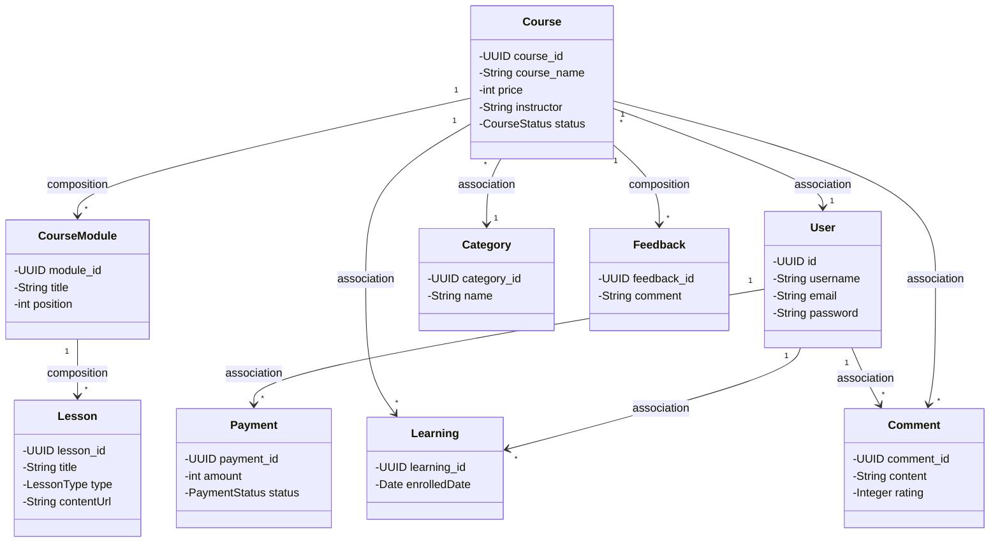
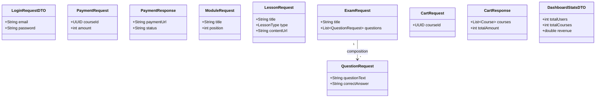

# 4.1.3 THIẾT KẾ CHI TIẾT GÓI
## Hệ Thống LMS - Web Dạy Lập Trình

---

## 📦 **GÓI 1: FRONTEND - PAGES PACKAGE**

### Mô tả:
Gói `pages` chứa các component đại diện cho các trang/views của ứng dụng. Các page components sử dụng components từ `components/common` và gọi API thông qua các services.

```mermaid
classDiagram
    class App {
        +BrowserRouter
        +Routes
        +Route
    }
    
    class HomeWrapper {
    }
    
    class CourseDetail {
    }
    
    class Courses {
    }
    
    class Profile {
    }
    
    class Learning {
    }
    
    class Assessment {
    }
    
    class AdminDashboard {
    }
    
    class Login {
    }
    
    class Register {
    }
    
    class Cart {
    }
    
    class Chat {
    }
    
    class Notifications {
    }
    
    class Navbar {
    }
    
    class Footer {
    }
    
    class CommentSection {
    }
    
    class courseService {
    }
    
    class authService {
    }
    
    class paymentService {
    }
    
    class cartService {
    }
    
    App -->|uses| HomeWrapper : dependency
    App -->|uses| CourseDetail : dependency
    App -->|uses| Courses : dependency
    App -->|uses| Profile : dependency
    App -->|uses| Learning : dependency
    App -->|uses| Assessment : dependency
    App -->|uses| AdminDashboard : dependency
    App -->|uses| Login : dependency
    App -->|uses| Register : dependency
    App -->|uses| Cart : dependency
    App -->|uses| Chat : dependency
    App -->|uses| Notifications : dependency
    
    CourseDetail -->|uses| Navbar : dependency
    CourseDetail -->|uses| Footer : dependency
    CourseDetail -->|uses| CommentSection : dependency
    CourseDetail -->|calls| courseService : dependency
    CourseDetail -->|calls| authService : dependency
    CourseDetail -->|calls| paymentService : dependency
    CourseDetail -->|calls| cartService : dependency
    
    Profile -->|uses| Navbar : dependency
    Profile -->|calls| authService : dependency
    
    Learning -->|uses| Navbar : dependency
    Learning -->|calls| courseService : dependency
```

**Giải thích thiết kế:**
- `App` là component gốc quản lý routing, phụ thuộc vào tất cả các page components
- Các page components (`CourseDetail`, `Profile`, `Learning`, etc.) phụ thuộc vào các common components (`Navbar`, `Footer`, `CommentSection`) và các services để gọi API
- Mối quan hệ là **dependency** vì các page sử dụng components và services nhưng không sở hữu chúng

---

## 📦 **GÓI 2: FRONTEND - COMPONENTS PACKAGE**

### Mô tả:
Gói `components/common` chứa các UI component có thể tái sử dụng được sử dụng bởi các page components.

```mermaid
classDiagram
    class Navbar {
    }
    
    class Footer {
    }
    
    class CommentSection {
    }
    
    class UserDropdown {
    }
    
    class NotificationDropdown {
    }
    
    class NotificationModal {
    }
    
    class TAAssistantButton {
    }
    
    class InputField {
    }
    
    class authService {
    }
    
    class messageService {
    }
    
    class notificationService {
    }
    
    class profileService {
    }
    
    class cartService {
    }
    
    Navbar -->|uses| UserDropdown : composition
    Navbar -->|uses| NotificationDropdown : composition
    Navbar -->|calls| authService : dependency
    Navbar -->|calls| messageService : dependency
    Navbar -->|calls| notificationService : dependency
    Navbar -->|calls| profileService : dependency
    Navbar -->|calls| cartService : dependency
    
    NotificationDropdown -->|uses| NotificationModal : dependency
    NotificationDropdown -->|calls| notificationService : dependency
```

**Giải thích thiết kế:**
- `Navbar` có quan hệ **composition** với `UserDropdown` và `NotificationDropdown` vì chúng là phần không thể tách rời của Navbar
- Các components phụ thuộc vào các services để lấy dữ liệu và thực hiện các thao tác

---

## 📦 **GÓI 3: FRONTEND - API/SERVICES PACKAGE**

### Mô tả:
Gói `api` chứa các service classes xử lý API calls và business logic liên quan đến data. Các services sử dụng axios instance từ `config` và các utility functions.

```mermaid
classDiagram
    class api {
        +baseURL
        +interceptors
    }
    
    class courseService {
        +getAllCourses()
        +getCourseById()
        +getModules()
        +getLessons()
    }
    
    class authService {
        +login()
        +register()
        +isUserAuthenticated()
    }
    
    class paymentService {
        +createPayment()
        +getPaymentStatus()
    }
    
    class cartService {
        +addToCart()
        +getCart()
        +removeFromCart()
    }
    
    class commentService {
        +getComments()
        +postComment()
    }
    
    class learningService {
        +enrollCourse()
        +getLearningProgress()
    }
    
    class axiosConfig {
    }
    
    class markdownParser {
    }
    
    courseService -->|uses| api : dependency
    authService -->|uses| api : dependency
    paymentService -->|uses| api : dependency
    cartService -->|uses| api : dependency
    commentService -->|uses| api : dependency
    learningService -->|uses| api : dependency
    
    api -->|uses| axiosConfig : dependency
    
    courseService -->|uses| markdownParser : dependency
```

**Giải thích thiết kế:**
- Tất cả các service classes phụ thuộc vào `api` (axios instance) để thực hiện HTTP requests
- `api` phụ thuộc vào `axiosConfig` để cấu hình interceptors và base URL
- Các services có thể sử dụng utility functions như `markdownParser` khi cần

---

## 📦 **GÓI 4: BACKEND - CONTROLLER PACKAGE**

### Mô tả:
Gói `controller` chứa các REST controllers xử lý HTTP requests từ frontend. Controllers sử dụng services để xử lý business logic và DTOs để chuyển đổi dữ liệu.

```mermaid
classDiagram
    class CourseController {
        +getAllCourses()
        +getCourseById()
        +createCourse()
        +updateCourse()
        +deleteCourse()
    }
    
    class AuthController {
        +login()
        +register()
        +logout()
    }
    
    class PaymentController {
        +createPayment()
        +getPaymentStatus()
    }
    
    class UserController {
        +getUserProfile()
        +updateUserProfile()
    }
    
    class CartController {
        +addToCart()
        +getCart()
    }
    
    class CourseService {
    }
    
    class AuthService {
    }
    
    class PaymentService {
    }
    
    class UserService {
    }
    
    class CartService {
    }
    
    class UserPrincipal {
    }
    
    class LoginRequestDTO {
    }
    
    class PaymentRequest {
    }
    
    CourseController -->|uses| CourseService : dependency
    AuthController -->|uses| AuthService : dependency
    PaymentController -->|uses| PaymentService : dependency
    UserController -->|uses| UserService : dependency
    CartController -->|uses| CartService : dependency
    
    CourseController -->|uses| UserPrincipal : dependency
    AuthController -->|uses| LoginRequestDTO : dependency
    PaymentController -->|uses| PaymentRequest : dependency
```

**Giải thích thiết kế:**
- Các controllers phụ thuộc vào các services tương ứng để xử lý business logic
- Controllers sử dụng DTOs để nhận và trả về dữ liệu
- Controllers sử dụng `UserPrincipal` từ security package để xác thực và phân quyền

---

## 📦 **GÓI 5: BACKEND - SERVICE PACKAGE**

### Mô tả:
Gói `service` chứa business logic của ứng dụng. Services sử dụng repositories để truy cập database và DTOs để xử lý dữ liệu.

```mermaid
classDiagram
    class CourseService {
        +getAllCourses()
        +getCourseById()
        +createCourse()
        +updateCourse()
        +deleteCourse()
    }
    
    class AuthService {
        +authenticate()
        +register()
    }
    
    class PaymentService {
        +processPayment()
        +verifyPayment()
    }
    
    class NotificationService {
        +sendNotification()
    }
    
    class CourseRepository {
    }
    
    class UserRepository {
    }
    
    class PaymentRepository {
    }
    
    class CategoryRepository {
    }
    
    class LearningRepository {
    }
    
    class PaymentRequest {
    }
    
    class LoginRequestDTO {
    }
    
    CourseService -->|uses| CourseRepository : dependency
    CourseService -->|uses| CategoryRepository : dependency
    CourseService -->|uses| LearningRepository : dependency
    CourseService -->|uses| NotificationService : dependency
    
    AuthService -->|uses| UserRepository : dependency
    
    PaymentService -->|uses| PaymentRepository : dependency
    PaymentService -->|uses| PaymentRequest : dependency
    
    CourseService -->|uses| PaymentRequest : dependency
    AuthService -->|uses| LoginRequestDTO : dependency
```

**Giải thích thiết kế:**
- Các services phụ thuộc vào các repositories để truy cập và thao tác với database
- Services có thể sử dụng các services khác (ví dụ: `CourseService` sử dụng `NotificationService`)
- Services sử dụng DTOs để xử lý dữ liệu đầu vào và đầu ra

---

## 📦 **GÓI 6: BACKEND - REPOSITORY PACKAGE**

### Mô tả:
Gói `repository` chứa các repository interfaces mở rộng từ JpaRepository để truy cập database. Repositories map dữ liệu với entity objects.

```mermaid
classDiagram
    class JpaRepository~T,ID~ {
        <<interface>>
    }
    
    class CourseRepository {
        +findByStatus()
        +searchCourses()
    }
    
    class UserRepository {
        +findByEmail()
        +findByUsername()
    }
    
    class PaymentRepository {
        +findByUserId()
        +findByStatus()
    }
    
    class CategoryRepository {
        +findAll()
    }
    
    class LearningRepository {
        +findByUserId()
        +findByCourseId()
    }
    
    class CourseModuleRepository {
        +findByCourseOrderByPositionAsc()
    }
    
    class LessonRepository {
        +findByModuleOrderByPositionAsc()
    }
    
    class Course {
    }
    
    class User {
    }
    
    class Payment {
    }
    
    class Category {
    }
    
    class Learning {
    }
    
    class CourseModule {
    }
    
    class Lesson {
    }
    
    CourseRepository ..|> JpaRepository : implements
    UserRepository ..|> JpaRepository : implements
    PaymentRepository ..|> JpaRepository : implements
    CategoryRepository ..|> JpaRepository : implements
    LearningRepository ..|> JpaRepository : implements
    CourseModuleRepository ..|> JpaRepository : implements
    LessonRepository ..|> JpaRepository : implements
    
    CourseRepository -->|maps| Course : association
    UserRepository -->|maps| User : association
    PaymentRepository -->|maps| Payment : association
    CategoryRepository -->|maps| Category : association
    LearningRepository -->|maps| Learning : association
    CourseModuleRepository -->|maps| CourseModule : association
    LessonRepository -->|maps| Lesson : association
```

**Giải thích thiết kế:**
- Tất cả các repositories **implement** interface `JpaRepository` từ Spring Data JPA
- Mỗi repository có quan hệ **association** với entity tương ứng để map dữ liệu từ database

---

## 📦 **GÓI 7: BACKEND - ENTITY PACKAGE**

### Mô tả:
Gói `entity` chứa các domain model objects đại diện cho dữ liệu trong database. Các entities có các mối quan hệ JPA với nhau.



**Giải thích thiết kế:**
- `Course` có quan hệ **composition** với `CourseModule` (1-to-many) - một Course có nhiều Modules, và khi Course bị xóa thì Modules cũng bị xóa
- `CourseModule` có quan hệ **composition** với `Lesson` (1-to-many)
- `Course` có quan hệ **association** với `User` (many-to-one) - nhiều Course thuộc về một User (instructor)
- `Course` có quan hệ **association** với `Category` (many-to-one)
- `User` có quan hệ **association** với `Payment` và `Learning` (1-to-many)
- `Course` có quan hệ **composition** với `Feedback` (1-to-many)

---

## 📦 **GÓI 8: BACKEND - DTO PACKAGE**

### Mô tả:
Gói `dto` chứa các Data Transfer Objects định nghĩa cấu trúc dữ liệu trao đổi giữa các layers (controller, service).



**Giải thích thiết kế:**
- Các DTOs là các class đơn giản chỉ chứa dữ liệu, không có business logic
- `ExamRequest` có quan hệ **composition** với `QuestionRequest` vì một Exam chứa nhiều Questions
- DTOs được sử dụng để truyền dữ liệu giữa controller và service layers

---

## 📦 **GÓI 9: BACKEND - SECURITY PACKAGE**

### Mô tả:
Gói `security` chứa các class xử lý authentication và authorization.

```mermaid
classDiagram
    class UserDetails {
        <<interface>>
    }
    
    class UserPrincipal {
        -UUID id
        -String name
        -String email
        -String password
        -Collection authorities
    }
    
    class JwtAuthTokenFilter {
        +doFilterInternal()
    }
    
    class JwtAuthenticationEntryPoint {
        +commence()
    }
    
    class JwtUtils {
        +generateToken()
        +validateToken()
        +getUserIdFromToken()
    }
    
    class User {
    }
    
    UserPrincipal ..|> UserDetails : implements
    UserPrincipal -->|creates from| User : dependency
    JwtAuthTokenFilter -->|uses| JwtUtils : dependency
    JwtAuthTokenFilter -->|uses| UserPrincipal : dependency
    JwtAuthenticationEntryPoint -->|handles| UserPrincipal : dependency
```

**Giải thích thiết kế:**
- `UserPrincipal` **implements** interface `UserDetails` từ Spring Security
- `UserPrincipal` được tạo từ `User` entity
- `JwtAuthTokenFilter` sử dụng `JwtUtils` để xử lý JWT tokens và `UserPrincipal` để xác thực

---

## 📦 **GÓI 10: BACKEND - CONFIG PACKAGE**

### Mô tả:
Gói `config` chứa các configuration classes cho Spring Boot application.

```mermaid
classDiagram
    class WebSecurityConfig {
        +securityFilterChain()
        +passwordEncoder()
    }
    
    class DatabaseMigrationConfig {
        +dataSource()
    }
    
    class JacksonConfig {
        +objectMapper()
    }
    
    class VnPayProperties {
        +String vnp_TmnCode
        +String vnp_HashSecret
    }
    
    class AdminInitializer {
        +onApplicationEvent()
    }
    
    class JwtAuthTokenFilter {
    }
    
    class JwtAuthenticationEntryPoint {
    }
    
    class PasswordEncoder {
        <<interface>>
    }
    
    WebSecurityConfig -->|uses| JwtAuthTokenFilter : dependency
    WebSecurityConfig -->|uses| JwtAuthenticationEntryPoint : dependency
    WebSecurityConfig -->|configures| PasswordEncoder : dependency
    DatabaseMigrationConfig -->|configures| DataSource : dependency
    AdminInitializer -->|creates| User : dependency
```

**Giải thích thiết kế:**
- `WebSecurityConfig` cấu hình Spring Security, sử dụng `JwtAuthTokenFilter` và `JwtAuthenticationEntryPoint`
- `DatabaseMigrationConfig` cấu hình database migration
- `AdminInitializer` tạo admin user khi ứng dụng khởi động
- `VnPayProperties` chứa cấu hình cho payment gateway

---

## 📊 **TỔNG KẾT CÁC MỐI QUAN HỆ**

### Các loại quan hệ được sử dụng:

1. **Dependency (Phụ thuộc)** - Mũi tên nét đứt (---->)
   - Sử dụng khi một class sử dụng class khác nhưng không sở hữu
   - Ví dụ: Controller → Service, Page → Component, Service → Repository

2. **Association (Kết hợp)** - Đường nét liền (---->)
   - Mối quan hệ giữa các entities độc lập
   - Ví dụ: Course → User, Course → Category

3. **Composition (Hợp thành)** - Đường nét liền với hình thoi đặc (◆---->)
   - Mối quan hệ "part-of", khi parent bị xóa thì child cũng bị xóa
   - Ví dụ: Course → CourseModule → Lesson, Course → Feedback

4. **Inheritance (Kế thừa)** - Đường nét liền với tam giác rỗng (▷---->)
   - Mối quan hệ "is-a"
   - Ví dụ: Repository → JpaRepository, UserPrincipal → UserDetails

5. **Implementation (Thực thi)** - Đường nét đứt với tam giác rỗng (..▷---->)
   - Class implements interface
   - Ví dụ: Repository implements JpaRepository, UserPrincipal implements UserDetails

---

## 📝 **GIẢI THÍCH THIẾT KẾ TỔNG THỂ**

### Nguyên tắc thiết kế:

1. **Separation of Concerns**: Mỗi package có trách nhiệm riêng biệt
   - Frontend: Pages (UI), Components (Reusable UI), Services (API calls)
   - Backend: Controller (HTTP), Service (Business Logic), Repository (Data Access), Entity (Domain Model)

2. **Dependency Inversion**: Các layer cao phụ thuộc vào layer thấp
   - Controller → Service → Repository → Entity
   - Pages → Components → Services

3. **Single Responsibility**: Mỗi class có một nhiệm vụ cụ thể
   - CourseController chỉ xử lý HTTP requests cho Course
   - CourseService chỉ chứa business logic cho Course

4. **Reusability**: Các components và services có thể tái sử dụng
   - Common components được sử dụng bởi nhiều pages
   - Services được sử dụng bởi nhiều controllers

5. **Layered Architecture**: Kiến trúc phân lớp rõ ràng
   - Frontend: Presentation Layer → Service Layer → Backend API
   - Backend: Controller Layer → Service Layer → Repository Layer → Database
